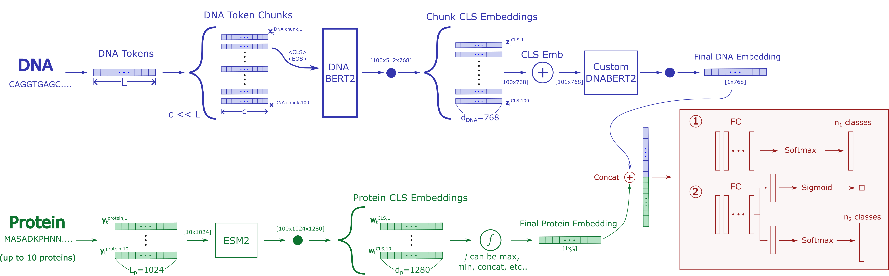
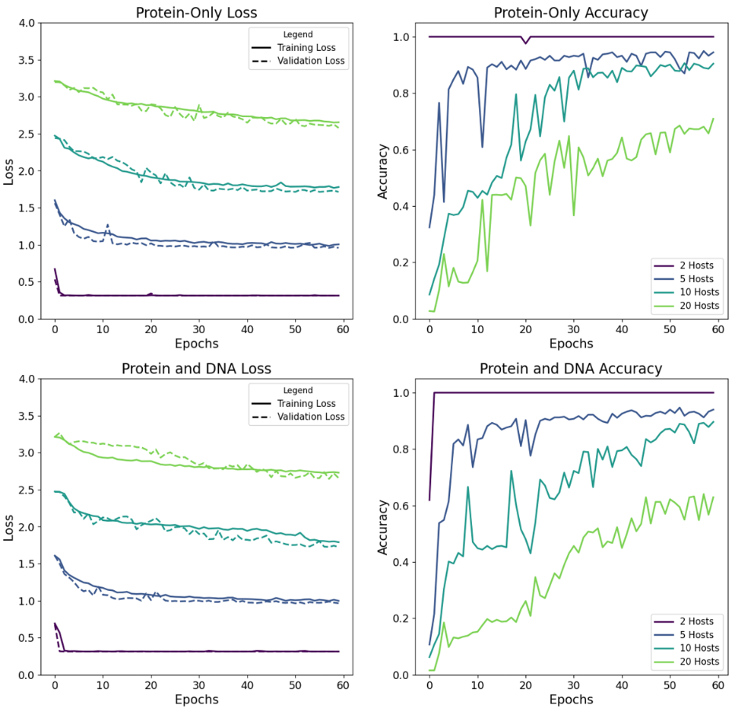
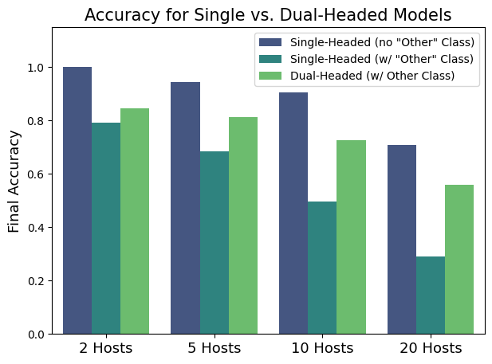

# Enhancing Phage-Bacteria Interaction Predictions with Multimodal Sequence Embeddings

## Project Overview

This project explores the use of machine learning models to predict phage-bacteria interactions (PBIs) by integrating a multimodal combination DNA and protein sequence information. We utilize DNABERT-2 and ESM-2 transformer models to embed biological sequence data, perform transfer learning from the embedding models, and make classification predictions. The research investigates different model architectures, including a dual-headed classifier that significantly improves prediction performance over a single-headed classifier model when "Other" class is included as an option

  
*Figure 1: Summary of multimodal model architecture*

## Key Findings

- The dual-headed classifier model significantly improves performance compared to a single-headed classifier.
- The multimodal model combining DNA and protein data does not outperform the protein-only model, suggesting more investigation is needed with advanced DNA models.
- The inclusion of an "Other" class, which captures interactions not among preselected hosts, challenges the model's accuracy but is crucial for realistic scenarios.

## Repository Structure

### Report
- `phage_bacteria_prediction_paper.pdf`: A finalized pdf version of the project report.
  
### Python Scripts

- `datasets.py`: Handles data loading and preparation.
- `feature_extraction.py`: Extracts features from DNA and protein sequences.
- `models.py`: Defines model architectures and configurations.
- `optuna_experiment.py`: Conducts hyperparameter optimization using Optuna.
- `plot_results.py`: Generates plots for analysis and visualization of results.
- `preprocess_data.py`: Preprocesses raw data for model input.
- `setup.py`: Loads the DNABERT-2 model and tokenizer for local or Colab environments.
- `storage.py`: Manages data storage and retrieval.
- `training.py`:  Manages data sampling, predictions, and training for various model architectures.

### Jupyter Notebooks

- `Data_Collection.ipynb`: Performs initial exploratory data analysis (EDA) and retrieves data from the NCBI API.
- `Verify_Data.ipynb`: Validated and preprocesses collected data, and performers further exploratary data analysis.  
- `Embed_to_CLS.ipynb`: Converts DNA and protein sequence data into embeddings using the appropriate models and stores them in a database.
- `Train_Model.ipynb`: Executes the training and validation of models using the processed data.

## Results

The study evaluated various model configurations, including protein-only and multimodal DNA/protein models, to predict phage-bacteria interactions (PBIs). The protein-only model achieved high accuracy across multiple top-n host experiments, while the multimodal model did not show significant improvements. Introducing an "Other" class to handle non-top hosts reduced performance in a single-headed classifier. However, the dual-headed classifier mitigated this performance loss, demonstrating improved accuracy by distinguishing between "Main Class" and "Other" interactions effectively.

  
   
  <em>Figure 2: Loss and accuracy curves for the protein-only and multimodal models, illustrating comparative performance.</em>

  <!-- Adding line breaks for space -->

  
   
  <em>Figure 3: Accuracy results for the single-headed classifier with and without the "Other" class, as well as the dual-headed classifier with the "Other" class.</em>

## Discussion

The integration of DNA data with protein sequences was hypothesized to enhance model performance. However, the results indicate that protein data alone provided robust predictions, while the addition of DNA data did not yield expected improvements. This may be attributed to the complexity of genetic data, which diluted the model's ability to capture relevant signals. The introduction of the "Other" class presented challenges in prediction accuracy. The dual-headed classifier approach effectively addressed these challenges by separating the classification tasks, thus improving the model's ability to identify interactions outside the top-n hosts.

## Conclusion

This research highlights the potential of machine learning models in predicting PBIs as a means to combat antimicrobial resistance. The dual-headed classifier demonstrated significant improvements in accuracy, particularly when accounting for interactions not among preselected hosts. Although the incorporation of DNA data did not enhance predictions, the findings suggest avenues for future work to explore advanced DNA encoding techniques and refined embedding strategies. The project underscores the importance of innovative model architectures in addressing complex biological prediction tasks.

