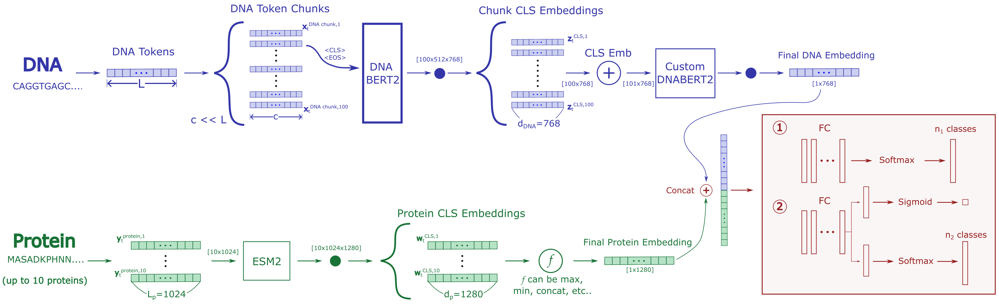
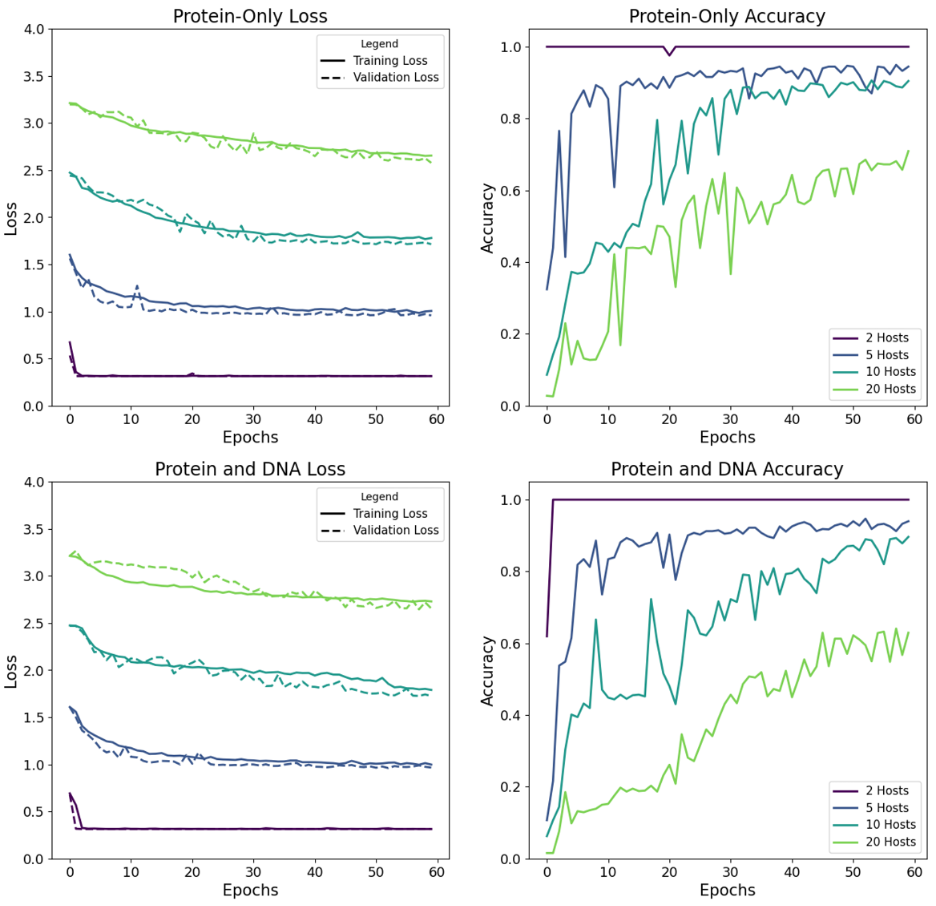
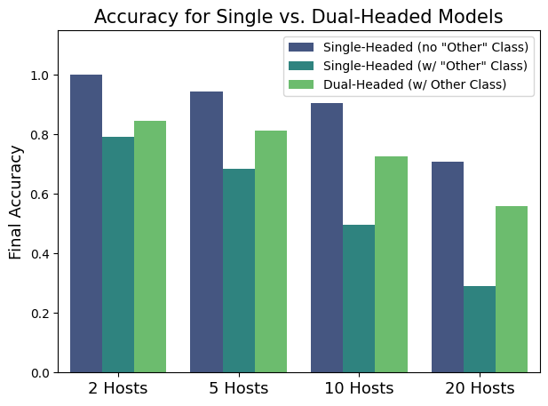

# Enhancing Phage-Bacteria Interaction Predictions with Multimodal Sequence Embeddings

## Project Overview

This project explores the use of machine learning models to predict phage-bacteria interactions (PBIs) by integrating a multimodal combination DNA and protein sequence information. We utilize DNABERT-2 and ESM-2 transformer models to embed biological sequence data, perform transfer learning from the embedding models, and make classification predictions. The research investigates different model architectures, including a dual-headed classifier that significantly improves prediction performance over a single-headed classifier model when "Other" class is included as an option.

  
*Figure 1: Summary of multimodal model architecture*

## Key Findings

- The dual-headed classifier model significantly improves performance compared to a single-headed classifier.
- The multimodal model combining DNA and protein data does not outperform the protein-only model, suggesting more investigation is needed with advanced DNA models.
- The inclusion of an "Other" class, which captures interactions not among preselected hosts, challenges the model's accuracy but is crucial for realistic scenarios.


## Results

The study evaluated various model configurations, including protein-only and multimodal DNA/protein models, to predict phage-bacteria interactions (PBIs). The protein-only model achieved high accuracy across multiple top-n host experiments, while the multimodal model did not show significant improvements. Introducing an "Other" class to handle non-top hosts reduced performance in a single-headed classifier. However, the dual-headed classifier mitigated this performance loss, demonstrating improved accuracy by distinguishing between "Main Class" and "Other" interactions effectively.

<div align="center">
  
  <br>
  <em>Figure 2: Loss and accuracy curves for the protein-only and multimodal models, illustrating comparative performance.</em>
</div>

<br> <!-- Adding line breaks for space -->

<div align="center">
  
  <br>
  <em>Figure 3: Accuracy results for the single-headed classifier with and without the "Other" class, as well as the dual-headed classifier with the "Other" class.</em>
</div>

## Discussion

The integration of DNA data with protein sequences was hypothesized to enhance model performance. However, the results indicate that protein data alone provided robust predictions, while the addition of DNA data did not yield expected improvements. This may be attributed to the complexity of genetic data, which diluted the model's ability to capture relevant signals. The introduction of the "Other" class presented challenges in prediction accuracy. The dual-headed classifier approach effectively addressed these challenges by separating the classification tasks, thus improving the model's ability to identify interactions outside the top-n hosts.

## Conclusion

This research highlights the potential of machine learning models in predicting PBIs as a means to combat antimicrobial resistance. The dual-headed classifier demonstrated significant improvements in accuracy, particularly when accounting for interactions not among preselected hosts. Although the incorporation of DNA data did not enhance predictions, the findings suggest avenues for future work to explore advanced DNA encoding techniques and refined embedding strategies. The project underscores the importance of innovative model architectures in addressing complex biological prediction tasks.

# Install and Run Model

## Features
- The protein-only model is provided for download and use, as it offers comparable performance to the more complex DNA-protein model without the added complexity.
- The model predicts the bacterial host for a given phage from a list of **10** specific bacteria, with all other bacteria classified under "Other".

## 🛠️ Installation

1. **Clone the Repository**
   ```bash
   git clone https://github.com/bbleier/PhageHostPrediction.git
   cd PhageHostPrediction
   ```
2. **Install Dependencies**
   ```bash
   pip install -r requirements.txt
   ```

##  🚦 Quick Start

### Load the Pre-trained Pipeline
```python
import torch
from pipeline import CustomPipeline

# Set the device (use GPU if available)
device = torch.device('cuda' if torch.cuda.is_available() else 'cpu')

# Load the pre-trained pipeline
custom_pipeline = CustomPipeline.from_pretrained('./', device=device)
```

### Prepare Sample Data

The input to the model should be a list of lists, where each inner list contains receptor binding protein (RBP) amino acid sequences for a single phage. For example:
```python
[
    ["RBP_sequence1", "RBP_sequence2", "RBP_sequence3"],  # Phage 1
    ["RBP_sequence4", "RBP_sequence5"]                   # Phage 2
]
```
**Note**: The model can process up to **10 proteins per phage**. If a phage has more than 10 proteins, only the first 10 will be included in the prediction, and the remaining proteins will be ignored.

Here is an example of how to load sample data:

```python
import pickle

# Load sample data
with open('sample_data/sample_data_NC_023553.pkl', 'rb') as f:
    sample_data_NC_023553 = pickle.load(f)

with open('sample_data/sample_data_JX570703.pkl', 'rb') as f:
    sample_data_JX570703 = pickle.load(f)   

sample_datas = [sample_data_NC_023553,  sample_data_JX570703]
```

### Run Predictions
```python
prediction_single = custom_pipeline({'protein_sequences': sample_data_NC_023553})

prediction_multiple = custom_pipeline({'protein_sequences': sample_datas})
```

### Model Outputs
#### Single Phage Prediction:
```python
[('Mycolicibacterium smegmatis', 0.9999)]
```

#### Multiple Phage Prediction:
```python
[('Mycolicibacterium smegmatis', 0.9999),
 ('Other', 0.6879), ...]
```
#### Classification Classes
The model predicts phage-bacteria interactions among the following bacteria:

- `Arthrobacter`
- `Escherichia coli`
- `Gordonia terrae`
- `Klebsiella pneumoniae`
- `Lactococcus lactis`
- `Microbacterium foliorum`
- `Mycolicibacterium smegmatis`
- `Pseudomonas aeruginosa`
- `Staphylococcus aureus`
- `Streptococcus thermophilus`

If a phage is predicted to interact with a bacterium not on this list, the output will be classified as `Other`. 


## 📁 Repository Structure

### Core Files and Directories
- `pipeline.py`: Defines the `CustomPipeline` class for preprocessing, model inference, and postprocessing.
- `model.py`: Contains the `DualHeadProteinOnlyClassifier` implementation.
- `load_model.py`: Handles loading of pre-trained model weights and configurations.
- `pytorch_model.bin`: Saved model weights for the pre-trained `DualHeadProteinOnlyClassifier`.
- `label_encoder_classes.pkl`: Serialized class labels for mapping predictions to human-readable categories.
- `config.json`: Configuration file containing model hyperparameters and metadata.

### Additional Directories
- `figures/`: Contains figures and visualizations used in the README or project documentation.
- `jupyter_notebooks/`: Includes Jupyter notebooks used for exploratory data analysis (EDA) and model training.
- `python_files/`: Contains Python scripts used during model development and training.
- `sample_data/`: Provides example input data for testing the pipeline.
- `report/`: Contains the final project report in PDF format.

### Supporting Files
- `requirements.txt`: Lists the required Python dependencies for the project.
